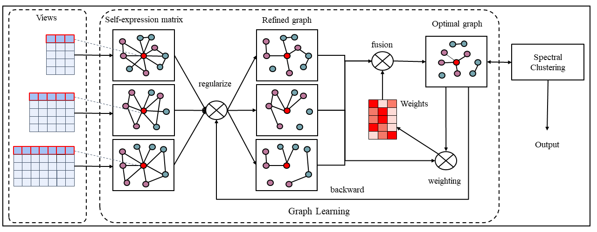

# FGL-MSC
Source code of paper: "Fine-grained graph learning for multi-view subspace clustering"  
The script is available: [paper](https://arxiv.org/abs/2201.04604)  
  

# Reference
This paper and codes are mainly inspired by ["Multi-graph Fusion for Multi-view Spectral Clustering"](https://github.com/sckangz/GFSC)
